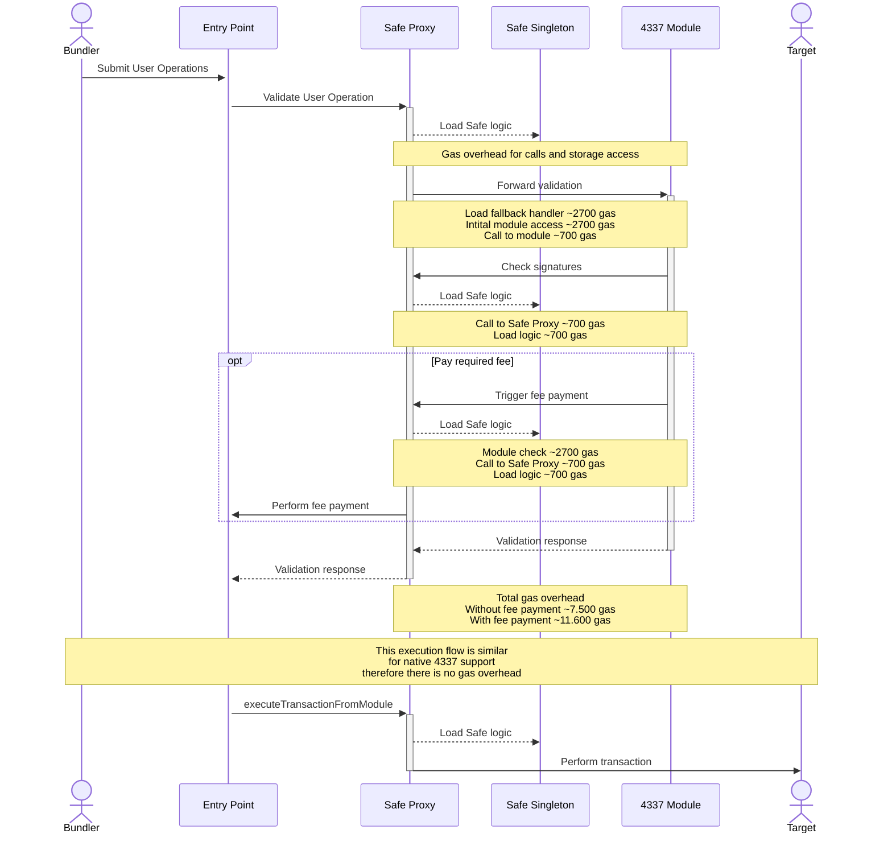

# Safe Module/Fallback handler for EIP4337 Support

The diagram below outlines the flow that is triggered when a user operation is submitted to via the entrypoint. Additionally the gas overhead compared to a native implementation is mentioned.



> :warning: **This branch contains changes that are under development** To use the latest audited version make sure to use the correct commit. The tagged versions that are used by the Safe team can be found in the [releases](https://github.com/5afe/eip4337-diatomic/releases).

## Usage

### Install requirements with yarn:

```bash
yarn
```

### Run all tests:

```bash
yarn build
yarn test
```

### Run script

```bash
yarn hardhat run scripts/runOp.ts --network goerli
```

### Deploy

> :warning: **Make sure to use the correct commit when deploying the contracts.** Any change (even comments) within the contract files will result in different addresses. The tagged versions that are used by the Safe team can be found in the [releases](https://github.com/5afe/eip4337-diatomic/releases).

This will deploy the contracts deterministically and verify the contracts on etherscan using [Solidity 0.7.6](https://github.com/ethereum/solidity/releases/tag/v0.7.6) by default.

Preparation:

- Set `MNEMONIC` in `.env`
- Set `INFURA_KEY` in `.env`

```bash
yarn deploy-all <network>
```

This will perform the following steps

```bash
yarn build
yarn hardhat --network <network> deploy
yarn hardhat --network <network> etherscan-verify
yarn hardhat --network <network> local-verify
```

#### Custom Networks

It is possible to use the `NODE_URL` env var to connect to any EVM based network via an RPC endpoint. This connection then can be used with the `custom` network.

E.g. to deploy the Safe contract suite on that network you would run `yarn deploy-all custom`.

The resulting addresses should be on all networks the same.

Note: Address will vary if contract code is changed or a different Solidity version is used.

### Verify contract

This command will use the deployment artifacts to compile the contracts and compare them to the onchain code

```bash
yarn hardhat --network <network> local-verify
```

This command will upload the contract source to Etherescan

```bash
yarn hardhat --network <network> etherscan-verify
```

## Documentation

- [Safe developer portal](http://docs.gnosis-safe.io)

## Security and Liability

All contracts are WITHOUT ANY WARRANTY; without even the implied warranty of MERCHANTABILITY or FITNESS FOR A PARTICULAR PURPOSE.

## License

All smart contracts are released under LGPL-3.0
